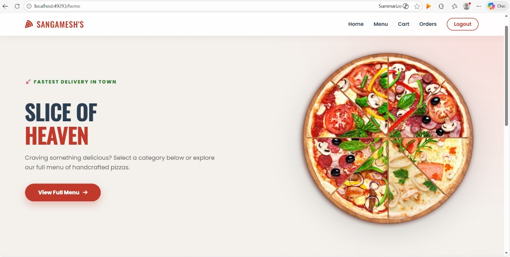
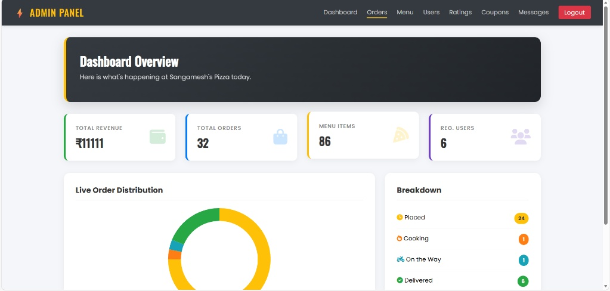

# 🍕 Sangamesh's Pizza Corner

> A full-stack pizza ordering web application built with Spring Boot, MongoDB, and Spring Security — featuring JWT authentication, an admin dashboard, and a complete order management system.

[](https://spring.io/projects/spring-boot)
[](https://www.mongodb.com/atlas)
[](https://www.oracle.com/java/)
[](https://jwt.io/)
[]()
[](LICENSE)

🔗 **[Live Demo](https://sangameshpizzawebapp.onrender.com)** &nbsp;|&nbsp; 📖 **[API Docs](https://sangameshpizzawebapp.onrender.com/swagger-ui/index.html)**

> ⚠️ Hosted on Render free tier — may take 30–50 seconds to wake up on first load.

---

## 📸 Screenshots

| Customer Home | Admin Dashboard |
|:---:|:---:|
|  |  |

---

## 🚀 Features

### 👤 Customer Side
- **Menu browsing** with category filters (Veg / Non-Veg) and dynamic size pricing (Standard / Medium +₹200 / Large +₹400)
- **Favorites system** — save items to a wishlist
- **Cart management** — increase, decrease, remove items; real-time total calculation
- **Coupon system** — apply discount codes (e.g. `WELCOME10`) with minimum order validation
- **Store open/close check** — cart blocks checkout when kitchen is closed
- **Simulated payment flow** — UPI and card payment simulation
- **Order tracking** — monitor status from Placed → Cooking → Out for Delivery → Delivered
- **PDF receipt download** — downloadable receipt per order
- **Order rating** — rate completed orders
- **Email notifications** — confirmation and status update emails via Mailtrap

### 🛡️ Admin Side
- **Dashboard** — revenue summary, active orders, customer stats
- **Menu management** — full CRUD (add, edit, delete items, prices, images, categories)
- **Order management** — update order statuses, view all orders
- **User management** — view all registered users
- **Coupon management** — create and manage discount codes
- **Ratings & reviews** — view customer feedback
- **Contact messages** — read customer enquiries
- **Master switch** — globally open or close the kitchen (disables ordering for all users instantly)

### 🔐 Security
- **JWT authentication** — stateless, cookie-based access and refresh tokens
- **Refresh token rotation** — every refresh issues a new token pair
- **Token revocation** — logout invalidates the refresh token in the database
- **Role-based access control** — `ROLE_USER` and `ROLE_ADMIN` with Spring Security
- **Password validation** — minimum 8 characters, must contain a letter and a number
- **BCrypt password encoding** — passwords never stored in plain text
- **Custom access denied handler** — clean 403 page instead of Spring default

---

## 🛠 Tech Stack

| Layer | Technology |
|:---|:---|
| Backend | Java 17, Spring Boot 3.x |
| Database | MongoDB Atlas |
| Frontend | Thymeleaf, HTML5, CSS3, JavaScript |
| Security | Spring Security, JWT (JJWT), BCrypt |
| API Docs | SpringDoc OpenAPI (Swagger UI) |
| Email | Spring Mail (Mailtrap sandbox) |
| PDF | Custom PdfService |
| Build | Maven |
| Testing | JUnit 5, Mockito, Spring Boot Test, DataMongoTest |
| Utilities | Lombok |

---

## 🧪 Tests

38 tests, all passing. Coverage spans the core application layers:

| Layer | Test Classes | Tests |
|:---|:---|:---:|
| Service | `UserServiceImplTest`, `JwtServiceTest`, `RefreshTokenServiceTest`, `CartServiceTest`, `FavoriteServiceTest` | 23 |
| Repository | `UserRepositoryTest`, `RefreshTokenRepositoryTest` | 7 |
| Controller | `AdminControllerTest`, `OrderControllerTest` | 5 |
| Filter | `JwtAuthenticationFilterTest` | 3 |

```bash
mvn test
```

---

## ⚙️ Setup & Installation

### Prerequisites
- Java 17+
- Maven 3.8+
- MongoDB Atlas account (or local MongoDB)
- Mailtrap account (for email sandbox)

### 1. Clone the repository
```bash
git clone https://github.com/sangamesh2k4/PizzaWebApp.git
cd PizzaWebApp
```

### 2. Create a `.env` file in the project root
```env
MONGODB_URI=mongodb+srv://<username>:<password>@cluster.mongodb.net/pizzadb
MAIL_USERNAME=your_mailtrap_username
MAIL_PASSWORD=your_mailtrap_password
JWT_SECRET=your_secret_key_minimum_32_characters_long
ADMIN_PASSWORD=your_admin_password
```

> **Never commit your `.env` file.** It is already in `.gitignore`.

### 3. Run the application
```bash
mvn spring-boot:run
```

The app starts at `http://localhost:8080`

---

## 🔑 Try the Demo

A demo user account is available to explore the customer experience:

| Field | Value |
|:---|:---|
| Email | `demo@pizza.com` |
| Password | `Demo@123` |

Admin access is restricted. To test admin features locally, set your own admin credentials via the `ADMIN_PASSWORD` environment variable.

---

## 📡 API Reference

Interactive API docs: [https://sangameshpizzawebapp.onrender.com/swagger-ui/index.html](https://sangameshpizzawebapp.onrender.com/swagger-ui/index.html)

### Auth endpoints (`/api/auth/**` — public)

| Method | Endpoint | Description |
|:---|:---|:---|
| `POST` | `/api/auth/register` | Register a new user |
| `POST` | `/api/auth/login` | Login, receive access + refresh tokens (cookies) |
| `POST` | `/api/auth/refresh` | Rotate refresh token, get new access token |
| `POST` | `/api/auth/logout` | Revoke refresh token, clear cookies |

### Key protected endpoints (require valid JWT cookie)

| Method | Endpoint | Role | Description |
|:---|:---|:---|:---|
| `GET` | `/orders` | USER | View own orders |
| `GET` | `/order/track` | USER | Track order status |
| `POST` | `/order/submit-rating` | USER | Rate a completed order |
| `GET` | `/orders/download/{id}` | USER | Download PDF receipt |
| `GET` | `/admin/dashboard` | ADMIN | Admin dashboard |
| `GET` | `/admin/orders` | ADMIN | Manage all orders |
| `GET` | `/admin/menu` | ADMIN | Manage menu items |
| `GET` | `/admin/users` | ADMIN | View all users |

---

## 📁 Project Structure

```
src/main/java/com/pizzaapp/PizzaWebApp/
├── config/         # SecurityConfig, OpenApiConfig, AdminDataLoader, handlers
├── controller/     # 17 controllers (Auth, Cart, Order, Admin, Payment, ...)
├── dto/            # AuthenticationRequest/Response, RefreshTokenRequest/Response
├── entity/         # User, Order, MenuItem, Coupon, RefreshToken, ...
├── exception/      # GlobalExceptionHandler, InvalidRefreshTokenException
├── filter/         # JwtAuthenticationFilter
├── entrypoint/     # JwtAuthenticationEntryPoint
├── model/          # Cart, CartItem
├── repository/     # 12 MongoDB repositories
└── service/        # UserServiceImpl, PizzaServiceImpl, JwtService, ...
```

---

## 🌐 Deployment

Deployed on **Render** with **MongoDB Atlas** as the cloud database.

To deploy your own instance, set these environment variables in your platform dashboard:

```
MONGODB_URI
MAIL_USERNAME
MAIL_PASSWORD
JWT_SECRET
ADMIN_PASSWORD
```

---

## 🏗 Architecture Highlights

- Layered architecture (Controller → Service → Repository)
- Stateless JWT authentication with cookie-based token delivery
- Refresh token rotation and revocation stored in MongoDB
- Role-Based Access Control (RBAC) — USER and ADMIN roles
- Global exception handling with custom error pages
- Automated testing across service, repository, controller, and filter layers

---

## ⚠️ Known Limitations

- Payment flow is **simulated** — no real payment gateway is integrated. UPI and card screens are demo only.
- Email delivery uses **Mailtrap sandbox** — emails are captured in the Mailtrap inbox, not delivered to real addresses.
- Hosted on Render free tier — cold starts may take 30–50 seconds after inactivity.

---

## 📄 License

This project is licensed under the MIT License. See [LICENSE](LICENSE) for details.
